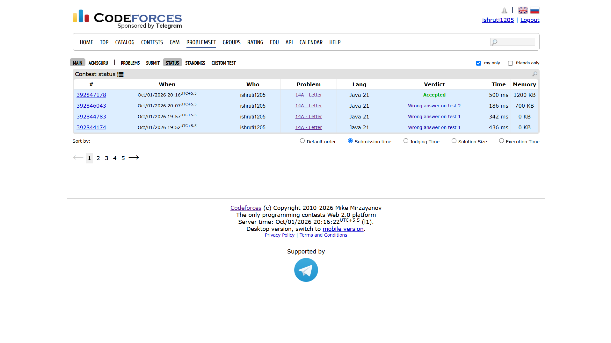

## Date: 01 October 2026 (Day 1)  
**Name:** Shruti  
**Programming Language:** Java 

## Problem
[A. Letter](https://codeforces.com/problemset/problem/14/A)

## Approach
I first find the minimum and maximum row and column indices containing *. These four boundaries define the smallest rectangle containing all the stars. Then, I print only the characters within this rectangle to get the required letter.

## Code

```java
import java.util.Scanner;

public class Main14A {
    public static void main(String[] args){
        Scanner sc = new Scanner(System.in);
        
        int n = sc.nextInt();
        int m = sc.nextInt();

        String[][] sheet = new String[n][m];
        
        for (int i = 0; i < n; i++) {
            String row = sc.next();
    
            for (int j = 0; j < m; j++) {
                sheet[i][j] = String.valueOf(row.charAt(j));
            }
        }

        sc.close();

        int minRow = n;
        int maxRow = -1;
        int minCol = m;
        int maxCol = -1;

        for (int i = 0; i < n; i++) {
            for (int j = 0; j < m; j++) {
                if (sheet[i][j].equals("*")) {
                    minRow = Math.min(minRow, i);
                    maxRow = Math.max(maxRow, i);
                    minCol = Math.min(minCol, j);
                    maxCol = Math.max(maxCol, j);
                }
            }
        }

        for (int i = minRow; i <= maxRow; i++) {
            for (int j = minCol; j <= maxCol; j++) {
                System.out.print(sheet[i][j]);
            }
            System.out.println();
        }

    }
}

/* 
Input 1:
6 7
.......
..***..
..*....
..***..
..*....
..***..

Output 1:
***
*..
***
*..
***

Input 2:
3 3
***
*.*
***

Output 2:
***
*.*
***
*/
```

## Accepted Solution Screenshot

