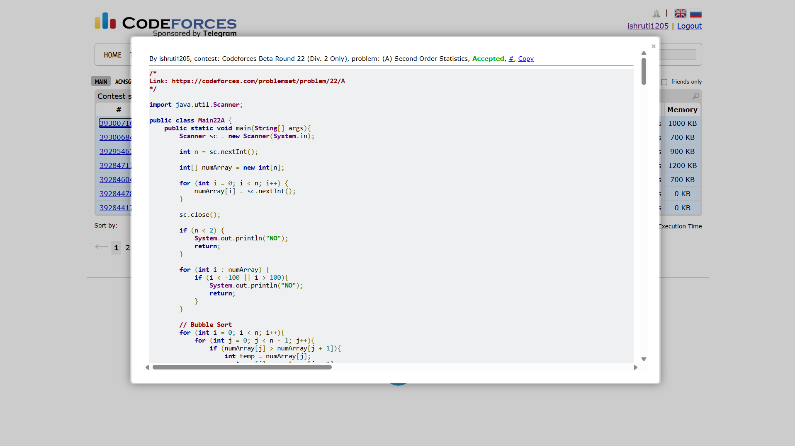

## Date: 03 October 2026 (Day 3)  
**Name:** Shruti  
**Programming Language:** Java 

## Problem
[A. Second Order Statistics](https://codeforces.com/problemset/problem/22/A)

## Approach
I first check that the input contains at least two elements and then sort the array using Bubble Sort. After sorting, I scan the array for the first pair of consecutive distinct elements. The second value in this pair is the second smallest distinct element, so I print it. If no distinct element exists, I print NO.

## Code

```java
import java.util.Scanner;

public class Main22A {
    public static void main(String[] args){
        Scanner sc = new Scanner(System.in);
        
        int n = sc.nextInt();

        int[] numArray = new int[n];
        
        for (int i = 0; i < n; i++) {
            numArray[i] = sc.nextInt();
        }

        sc.close();

        if (n < 2) {
            System.out.println("NO");
            return;
        }

        for (int i : numArray) {
            if (i < -100 || i > 100){
                System.out.println("NO");
                return;
            }
        }

        // Bubble Sort
        for (int i = 0; i < n; i++){
            for (int j = 0; j < n - 1; j++){
                if (numArray[j] > numArray[j + 1]){
                    int temp = numArray[j];
                    numArray[j] = numArray[j + 1];
                    numArray[j + 1] = temp;
                }
            }
        }

        for (int i = 0; i < n - 1; i++){
            if (numArray[i] != numArray[i+1]){
                System.out.println(numArray[i+1]);
                return;
            }
        }

        // 10 10 10 20 30
        // 0  1  2  3  4

        System.out.println("NO");  // when there are no distinct elements
        
    }

}

/* 
Input 1:
4
1 2 2 -4

Output 1:
1

Input 2:
5
1 2 3 1 1

Output 2:
2
*/
```

## Accepted Solution Screenshot

