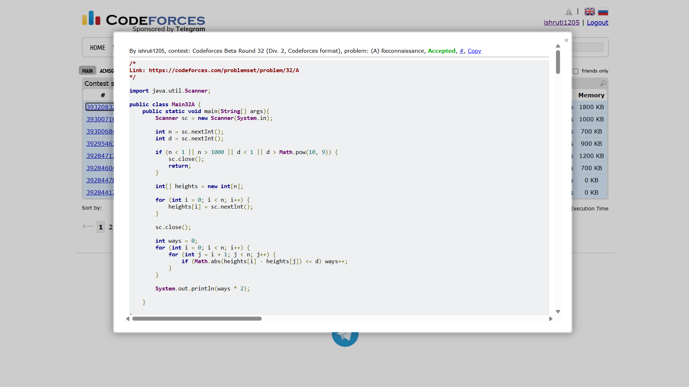

## Date: 04 October 2026 (Day 4)  
**Name:** Shruti  
**Programming Language:** Java 

## Problem
[A. Second Order Statistics](https://codeforces.com/problemset/problem/32/A)

## Approach
I use two nested loops to check every possible pair of friends. If the absolute difference between their heights is at most d, that pair is valid. Since each valid pair can be chosen in either order, I multiply the total count by 2 to get the number of ordered pairs.

## Code

```java
import java.util.Scanner;

public class Main32A {
    public static void main(String[] args){
        Scanner sc = new Scanner(System.in);
        
        int n = sc.nextInt();
        int d = sc.nextInt();

        if (n < 1 || n > 1000 || d < 1 || d > Math.pow(10, 9)) {
            sc.close();
            return;
        }

        int[] heights = new int[n];
        
        for (int i = 0; i < n; i++) {
            heights[i] = sc.nextInt();
        }

        sc.close();

        int ways = 0;
        for (int i = 0; i < n; i++) {
            for (int j = i + 1; j < n; j++) {
                if (Math.abs(heights[i] - heights[j]) <= d) ways++;
            }
        }  
        
        System.out.println(ways * 2);

    }

}

/* 
Input 1:
5 10
10 20 50 60 65

Output 1:
6

Input 2:
5 1
55 30 29 31 55

Output 2:
6
*/
```

## Accepted Solution Screenshot

