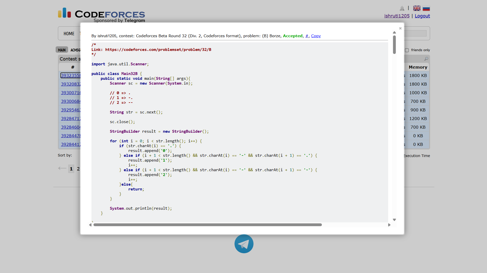

## Date: 05 October 2026 (Day 5)  
**Name:** Shruti  
**Programming Language:** Java 

## Problem
[B. Borze](https://codeforces.com/problemset/problem/32/B)

## Approach
I scan the encoded string from left to right. A < . > represents 0, while < -. > represents 1 and < -- > represents 2. Whenever a two-character code is found, I skip the next character and append the corresponding digit to the result.

## Code

```java
import java.util.Scanner;

public class Main32B {
    public static void main(String[] args){
        Scanner sc = new Scanner(System.in);

        String str = sc.next();
        
        sc.close();
        
        StringBuilder result = new StringBuilder();
        
        // 0 => .
        // 1 => -.
        // 2 => --

        for (int i = 0; i < str.length(); i++) {
            if (str.charAt(i) == '.') {
                result.append('0');
            } else if (i + 1 < str.length() && str.charAt(i) == '-' && str.charAt(i + 1) == '.') {
                result.append('1');
                i++;
            } else if (i + 1 < str.length() && str.charAt(i) == '-' && str.charAt(i + 1) == '-') {
                result.append('2');
                i++;
            }else{
                return;
            }
        }

        System.out.println(result);
    }

}

/* 
Input 1:
.-.--

Output 1:
012

Input 2:
--.

Output 2:
20

Input 2:
-..-.--

Output 2:
1012
*/
```

## Accepted Solution Screenshot

