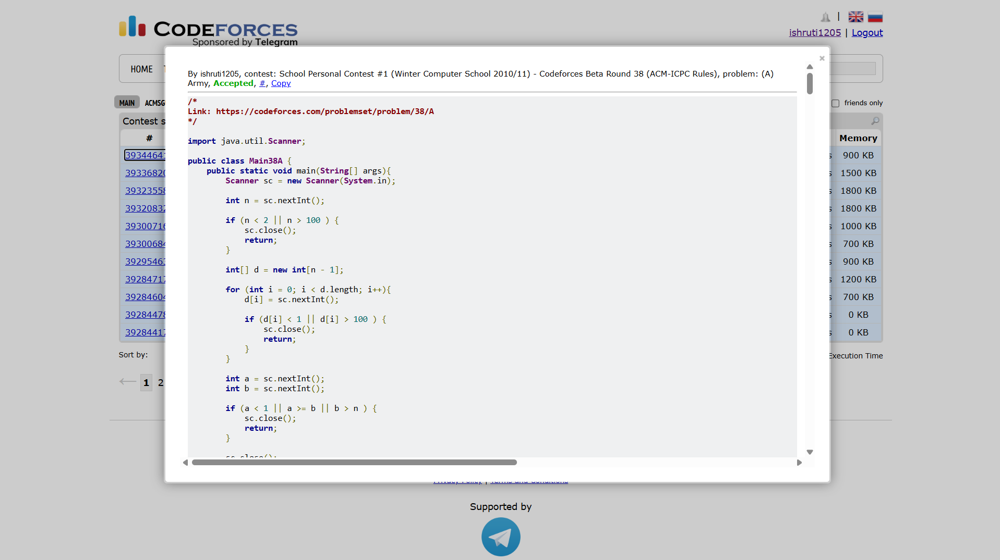

## Date: 07 October 2026 (Day 7)  
**Name:** Shruti  
**Programming Language:** Java 

## Problem
[A. Army](https://codeforces.com/problemset/problem/38/A)

## Approach
I store the number of years required to move between each pair of consecutive ranks. Then, for ranks a to b, I sum the corresponding values from d[a - 1] to d[b - 2] to get the total number of years.

## Code

```java
/*
Link: https://codeforces.com/problemset/problem/38/A
*/

import java.util.Scanner;

public class Main38A {
    public static void main(String[] args){
        Scanner sc = new Scanner(System.in);
        
        int n = sc.nextInt();

        if (n < 2 || n > 100 ) {
            sc.close();
            return;
        }

        int[] d = new int[n - 1];

        for (int i = 0; i < d.length; i++){
            d[i] = sc.nextInt();

            if (d[i] < 1 || d[i] > 100 ) {
                sc.close();
                return;
            }
        }

        int a = sc.nextInt();
        int b = sc.nextInt();

        if (a < 1 || a >= b || b > n ) {
            sc.close();
            return;
        }

        sc.close();

        int year = 0;
        for(int i = a - 1; i < b - 1; i++){
            year += d[i];
        }

        System.out.println(year);
        
    }

}

/* 
Input 1:
3
5 6
1 2

Output 1:
5

Input 2:
3
5 6
1 3

Output 2:
11
*/
```

## Accepted Solution Screenshot

