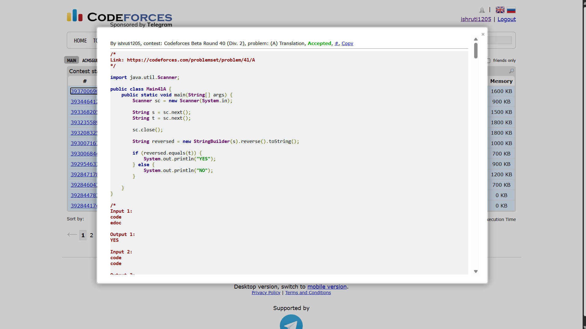

## Date: 08 October 2026 (Day 8)  
**Name:** Shruti  
**Programming Language:** Java 

## Problem
[A. Translation](https://codeforces.com/problemset/problem/41/A)

## Approach
I reverse the first string s using StringBuilder and compare it with the second string t. If both strings are equal, I print YES; otherwise, I print NO.

## Code

```java
/*
Link: https://codeforces.com/problemset/problem/41/A
*/

import java.util.Scanner;

public class Main41A {
    public static void main(String[] args) {
        Scanner sc = new Scanner(System.in);

        String s = sc.next();
        String t = sc.next();

        sc.close();
        
        String reversed = new StringBuilder(s).reverse().toString();

        if (reversed.equals(t)) {
            System.out.println("YES");
        } else {
            System.out.println("NO");
        }

    }
}

/* 
Input 1:
code
edoc

Output 1:
YES

Input 2:
code
code

Output 2:
NO
*/
```

## Accepted Solution Screenshot

