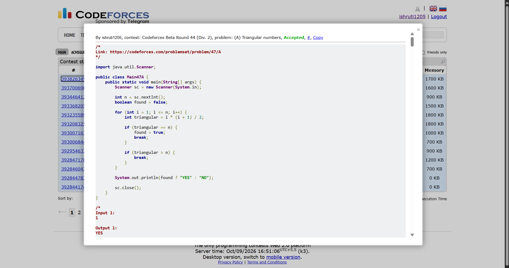

## Date: 09 October 2026 (Day 9)  
**Name:** Shruti  
**Programming Language:** Java 

## Problem
[A. Triangular numbers](https://codeforces.com/problemset/problem/47/A)

## Approach
I iterate from 1 to n and calculate the triangular number using the formula i * (i + 1) / 2. If the calculated value equals n, I print YES. If it exceeds n, I stop the loop. If no matching triangular number is found, I print NO.

## Code

```java
import java.util.Scanner;

public class Main {
    public static void main(String[] args) {
        Scanner sc = new Scanner(System.in);

        int n = sc.nextInt();
        boolean found = false;

        for (int i = 1; i <= n; i++) {
            int triangular = i * (i + 1) / 2;

            if (triangular == n) {
                found = true;
                break;
            }

            if (triangular > n) {
                break;
            }
        }

        System.out.println(found ? "YES" : "NO");

        sc.close();
    }
}

/*
Input 1:
1

Output 1:
YES

Input 2:
2

Output 2:
NO

Input 1:
3

Output 1:
YES
*/
```

## Accepted Solution Screenshot

