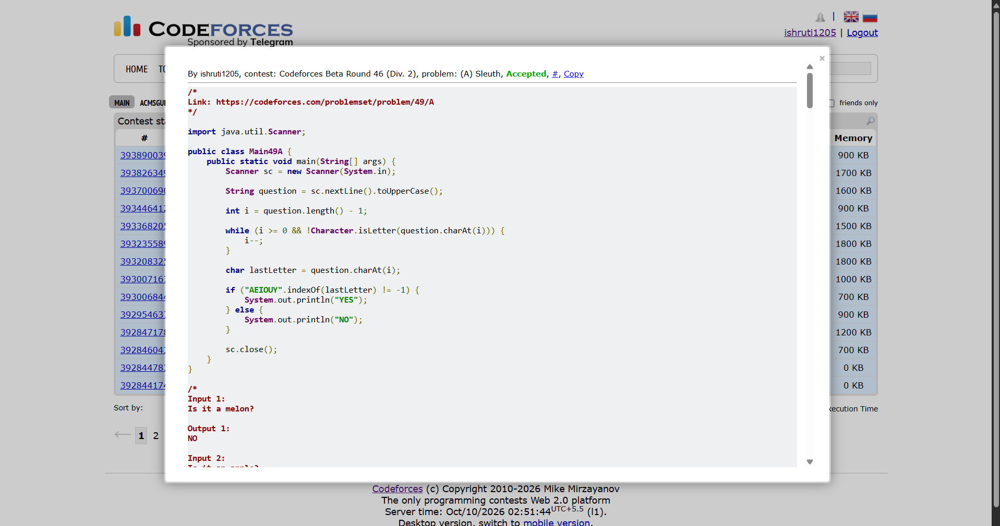

## Date: 10 October 2026 (Day 10)  
**Name:** Shruti  
**Programming Language:** Java 

## Problem
[A. Sleuth](https://codeforces.com/problemset/problem/49/A)

## Approach
I convert the input question to uppercase and scan backward to find the last letter, ignoring spaces and punctuation. Then, I check whether the letter belongs to AEIOUY. If it does, I print YES; otherwise, I print NO.

## Code

```java
/*
Link: https://codeforces.com/problemset/problem/49/A
*/

import java.util.Scanner;

public class Main49A {
    public static void main(String[] args) {
        Scanner sc = new Scanner(System.in);

        String question = sc.nextLine().toUpperCase();

        int i = question.length() - 1;

        while (i >= 0 && !Character.isLetter(question.charAt(i))) {
            i--;
        }

        char lastLetter = question.charAt(i);

        if ("AEIOUY".indexOf(lastLetter) != -1) {
            System.out.println("YES");
        } else {
            System.out.println("NO");
        }

        sc.close();
    }
}

/*
Input 1:
Is it a melon?

Output 1:
NO

Input 2:
Is it an apple?

Output 2:
YES

Input 3:
  Is     it a banana ?

Output 3:
YES

Input 3:
Is   it an apple  and a  banana   simultaneouSLY?

Output 3:
YES
*/
```

## Accepted Solution Screenshot

